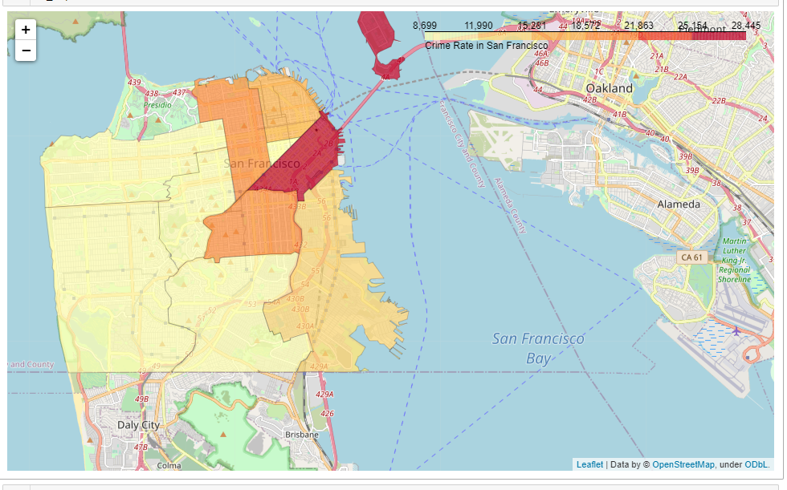

# About
This is an assignment I did as an assignment on Coursera on Data visualizations 
It covers two datasets:
1. Data Science Survey results which is contains results for a survey on different interests of people in different aspects of data science. It is obtained from this link :https://cocl.us/datascience_survey_data. I plotted two bar charts both showing the percentage of interest in three categories of seven different aspects of data science based on the number of respondents. The difference in the bar charts is that one has borders and the other does not
2. SF Neighborhood Crime Data which contains data on different crimes committed on different neighbourhoods in SF on different days of the week. I plotted a map using Folium to show the distribution of total reported crimes per neighbourhood

### Import necessary libraries for data wrangling, analysis and visualizations

### Data Science Survey Results
Load the survey results

#### Bar chart of Percentage of interest
Format the data for data analysis

Plot the graph

### SF Crime Data: Choropleth
Load the data set

### SF Crime on a Map

